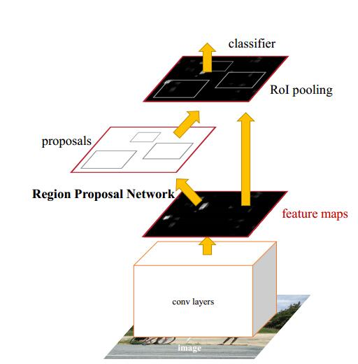

# RCNN,Fast-RCNN and Faster-RCNN #

Reference：[http://blog.csdn.net/gavin__zhou/article/details/51996615](http://blog.csdn.net/gavin__zhou/article/details/51996615)

- `RCNN` 解决的是，“为什么不用`CNN`做classification呢？”
- `Fast-RCNN` 解决的是，“为什么不一起输出bounding box和label呢？”
- `Faster-RCNN` 解决的是，“为什么还要用selective search呢？”(Selective Search 费时)

`Faster-RCNN`原理简介

在如何产生`proposal`进行加速，由传统的`Selective Search`到用`Nerual Net`来做`region proposal`。

在Fast-rcnn的基础上共享卷积层。用卷积后的特征图来生成region proposals。通过增加两个卷积层来实现Region Proposal Networks (RPNs) , 一个用来将每个特征图 的位置编码成一个向量，另一个则是对每一个位置输出一个 objectness score 和 regressed bounds for k region proposals.

## RPN(Region proposal NetWorks) ##

RPN 作用：

- 输出proposal的位置(坐标)和score
- 将不同scale和ratio的proposal映射为低维的feature vector
- 输出是否是前景的classification和进行位置的regression

Anthor概念:不同ratio和scale下的box集合就是anchor。最后一层卷积下生成的n*n区域，进行不同ratio和scale的采样

## RPN cls and reg ##

RPN输出对于某个proposal，其是属于前景或者背景的概率(0 or 1)，具体的标准论文里给出的是:

- 和所有的ground-truth的IoU(Intersection-over-union)小于0.3视为negative(背景)
- 和任意的ground-truth的IoU大于0.7视为positive(前景)
- 不属于以上两种情况的proposal直接丢掉，不进行训练使用

regression是对proposal位置的修正

- 学习k个bounding-box-regressors
- 每个regresso负责一个scale和ratio的proposal，k个regressor之间不共享权值

## RPN Training ##

两种训练方式: joint training和alternating training
两种训练的方式都是在预先训练好的model上进行fine-tunning，比如使用VGG16、ZF等，对于新加的layer初始化使用random initiation，使用SGD和BP在caffe上进行训练
alternating training

首先训练RPN, 之后使用RPN产生的proposal来训练Fast-RCNN, 使用被Fast-RCNN tuned的网络初始化RPN,如此交替进行
joint training

首先产生region proposal,之后直接使用产生的proposal训练Faster-RCNN，对于BP过程,共享的层需要combine RPN loss和Faster-RCNN loss

## PERFORMANCE ##
