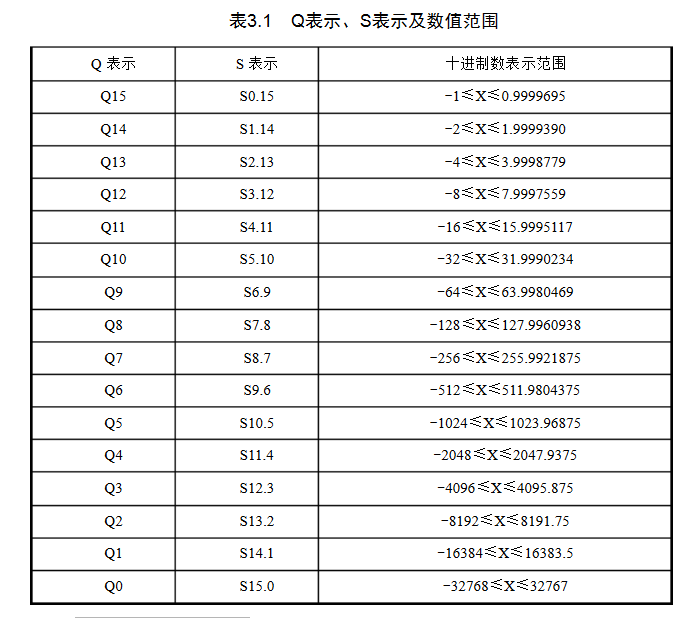
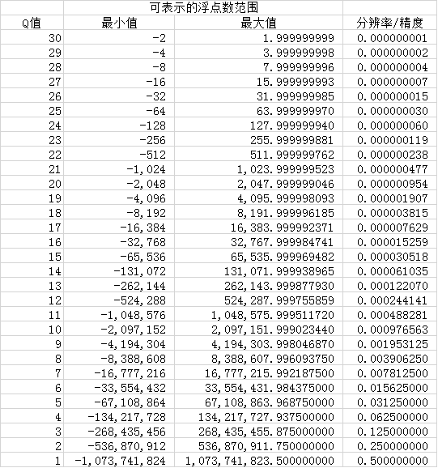

##Tips Matlab 矩阵优化性能问题##

>MATLAB的矩阵计算使用的是Intel自己出的Math kernel library（MKL）,这个库远比其他的blas/lapack库要快。

>C/C++快在循环,优化连接MKL，编写难比专业优化

>Python的NumPy矩阵运算仅仅是接近Matlab，但是在其他方面比Matlab有较好的性能。

常见的BLAS库的矩阵运算性能

1. EIGEN  
Eigen 是一个线性算术的C++模板库。功能强大、快速、优雅以及支持多平台，可以使用该库来方便处理一些矩阵的操作，达到类似matlab那样的快捷。 需要定义 EIGEN_NO_DEBUG 阻止运行时assertion。编译单线程版本需要开启 -DEIGEN_DONT_PARALLELIZE. 
2. Intel MKL  
英特尔数学核心函数库是一套经过高度优化和广泛线程化的数学例程，专为需要极致性能的科学、工程及金融等领域的应用而设计。它可以为当前及下一代英特尔处理器提供性能优化，包括更出色地与 Microsoft Visual Studio、Eclipse和XCode相集成。英特尔 MKL 支持完全集成英特尔兼容性 OpenMP 运行时库，以实现更出色的 Windows/Linux 跨平台兼容性。在试验中的多线程版本需要链接到 mkl_gnu_thread，而不是 mkl_intel_thread，单线程版本需要链接到 mkl_sequential_thread。
3. OpenBLAS   
OpenBLAS是高性能多核BLAS库，是GotoBLAS2 1.13 BSD版本的衍生版。OpenBLAS 的编译依赖系统环境，并且没有原生单线程版本，在实验这哦那个，通过设置 OMP_NUM_THREADS=1 来模拟单线程版本，可能会带来一点点的性能下降。

整体看，在单线程和多线程下，OpenBLAS最好，MKL次之，EIGEN最末

##Tips 浮点到定点转换##

### 简介 ###
采用定点数进行数值运算，其操作数一般采用整型数来表示。一个整型数的最大表示范围取决于运算芯片所给定的字长，一般为16位或24位。显然，字长越长，所能表示的数的范围越大，精度也越高。如无特别说明，本文均以16位字长为例。参与运算的数以二进制补码形式表示。每个16位数用一个符号位来表示数的正负，0表示数值为正，1则表示数值为负。其余15位表示数值的大小。

### 定点表示 ###

参与数值运算的数为16位的整型数。但在许多情况下，数学运算过程中的数不一定都是整数。应该说，运算芯片本身无法处理小数。关键就是由程序员来确定一个数的小数点处于16位中的哪一位。这就是数的定标。｛通过设定小数点在16位数中的不同位置，就可以表示不同大小和不同精度的小数｝数的定标有Q表示法和S表示法两种。下面列出了一个16位数的16种Q表示、S表示及它们所能表示的十进制数值范围：

浮点数转换为定点数时,为了降低截尾误差,可以在取整前可以先加上0.5，视情况而定。

### 定点加减法 ###

将浮点加法/减法转化为定点加法/减法时最重要的一点就是必须保证两个操作数的定标值一样。若两者不一样，则在做加法/减法运算前先进行小数点的调整。为保证运算精度，需使Q值小的数调整为与另一个数的Q值一样大。此外，在做加法/减法运算时，必须注意结果可能会超过16位表示。如果加法/减法的结果超出16位的表示范围，则必须保留32位结果，以保证运算的精度。

    // 设x的Q值为Qx，y的Q值为Qy，且Qx > Qy，加法/减法结果z的定标值为Qz  
    // 所以定点加法可以描述为：  
    int x,y,z;  
    long temp; // 临时变量  
    temp = y << (Qx - Qy);  
    // Q大-Q小，Q大的变量分辨率更高，Q小的左移增加其Q  
    temp = x + temp;  
    z = (int)(temp >> (Qx - Qz)); // if Qx >= Qz   
    z = (int)(temp << (Qz - Qx)); // if Qx <= Qz  

E.g.

	// 设x = 0.5，y = 3.1，则浮点运算结果为z = x+y = 0.5+3.1 = 3.6;  
	// Qx = 15，Qy = 13，Qz = 13，则定点加法为：  
	x = 16384；y = 25395;  
	temp = 25395 << 2 = 101580;  
	temp = x+temp = 16384+101580 = 117964;  
	z = (int)(117964L >> 2) = 29491;  
	// 因为z的Q值为13，所以定点值z = 29491即为浮点值z = 29491/8192 = 3.6。

### 定点乘法 ###

    int x,y,z;  
    long temp;  
    temp = (long)x;  
    z = (temp×y) >>(Qx+Qy-Qz);  

E.g.

	// 设x = 18.4，y = 36.8，则浮点运算值为z = 18.4×36.8 = 677.12;  
	// 根据上节，得Qx = 10，Qy = 9，Qz = 5，所以  
	x = 18841；y = 18841;  
	temp = 18841L; // Long int  
	z = (18841L * 18841) >> (10+9-5) = 354983281L >> 14 = 21666;  
	// 因为z的定标值为5，故定点 z = 21666即为浮点的 z = 21666/32 = 677.08 产生了精度损失 

### 定点除法 ###

	
	int x,y,z;
	long temp;
	temp = (long)x;
	z = (temp<<(Qz-Qx+Qy))/y ;

E.g.

	//设x = 18.4，y = 36.8，浮点运算值为z = x/y = 18.4/36.8 = 0.5;
	//根据上节，得Qx = 10，Qy = 9，Qz = 15；所以有
	x = 18841, y = 18841;
	temp = (long)18841;
	z = (18841L<<(15-10+9))/18841= 308690944L/18841 = 16384;
	//因为商z的定标值为15，所以定点z = 16384即为浮点 z = 16384/215= 0.5。

### 非线性运算定点的快速实现 ###

在数值运算中，除基本的加减乘除运算外，还有其他许多非线性运算，如对数运算、开方运算、指数运算、三角函数运算等，实现这些非线性运算的方法一般有：(1)调用DSP编译系统的库函数；(2)查表法；(3)混合法。主要介绍查表法

1．调用DSP编译系统的库函数

略

2.查表法

在实时DSP应用中实现非线性运算，一般都采取适当降低运算精度来提高程序的运算速度。查表法是快速实现非线性运算最常用的方法。采用这种方法必须根据自变量的范围和精度要求制作一张表格。显然输入的范围越大，精度要求越高，则所需的表格就越大，即存储量也越大。**查表法求值所需的计算就是根据输入值确定表的地址，根据地址就可得到相应的值，因而运算量较小。查表法比较适合于非线性函数是周期函数或已知非线性函数输入值范围这两种情况。**

	
例3.12  已知正弦函数y=sin(x)，制作一个512点表格，并说明查表方法。由于正弦函数是周期函数，函数值在－1至＋1之间，用查表法比较合适。由于Q15的表示范围为－1至32767/32768之间，原则上讲－1至＋1的范围必须用Q14表示。但一般从方便和总体精度考虑，类似情况仍用Q15表示，此时＋1用32767来表示。

(1)   建立正弦函数y=sin(x)值表。
Q=15时，产生512点正弦值的数学公式：i ——为index，Q ——为定标值，即产生512点值的C语言程序如下所示:

	/* Sample 3.12: Generate a sinewave table	
	 * Q = 15	
	 * N is the number of points
	 * i is the index of each value, 0:N
	 * float multiply and integerize.
	 */
	
	#define  N  512
	#define  pi  3.14159
	int  sin_tab[512];
	void  main()
	{
	  int i;
	  for(i=0;i<N;i++)
	      sin_tab[i]=(int)(32767*sin(2*pi*i/N));//32767 = 2^15 - 1
	}

(2) 查表

查表实际上就是根据输入值确定表的地址。设输入浮点x在0~2p之间，则x对应于512点表的地址为：index = (int)(512*x/2p)
则：y = sin(x) = sin_tab[index] 

如果此处把x用定点数表示，则取x的Q值为15-3=12. 因为0<x<6.29<8=2^3, 取Q=15-3可以最大限度保证x精度。将512/2p≈81.53. 2^6<81.53< 2^7=128用Q8（15 –7 = 8）表示才能将其囊括，其在Q8下的值为 (int)(81.53*2^8) = 20871，则计算正弦值表的地址的公式为：index = (x*20871L)>>20。此处index的类型本来就是int，且范围是[0:1:512]，故它的Q值为零。所以是右移 12+8-0=20位，得到0-512的index值。

 

	The whole program for generating sine wave table and usingit to get the sin value:	
	/* Sample 3.12: Generate a sinewave table	
	 * Q = 15	
	 * N is the number of points
	 * i is the index of each value, 0:N
	 * float multiply and intigerize.
	 */

	#include "stdafx.h"  // Thisis for visual studio C++	
	#include "stdio.h"	
	#include "math.h"	
	#include "string.h"		
	#define  pi  3.14159 
	
	/* Generate and inject the n point sine wave table Function
	 * Sine wave value is from -1 to +1,Select Q=15: [-1,0.9999695], 16bit int
	 * input the sin_table arraydeclared in main function
	 * Generate the sine value andmemcpy them into sin_table array
	 * Generate the fixed point valuefor sine wave. 32767 stands for 1.
	 * The fixed point sine value isfrom -32768 to 32767
	 *
	 */
	
	void usr_sineOcp(intshort sin_tab[],int n);//Declare sine wave table Function
	/* Generate the n-point(n<4096) sine wave table Function Body*/
	void usr_sineOcp(intshortsin_tab[],int n){
	  int short y[4096];// n < 4096
	  int i;
	  for(i=0;i<n;i++) {
	      y[i]=(int)(32767*sin(2*pi*i/n));  //32767 = 2^15 - 1
	      //printf("usr_sineOcp: y[%d] =%d \n", i, y[i]);
	  }
	  memcpy(sin_tab, y, 2*n);
	  return;
	}
	
	/* In main function, We will
	 * 1. Generate the empty sine_wavevalue table, 512points.
	 * 2. Occupy the sine_wave valuetable by calling usr_sineOcp(); function
	 * 3. print out the fixed/floatvalue of sine_wave value table.
	 * 4. Request user input float x,return float y.
	 *   float x_user_input = [0,2pi]
	 *   float y_ret_user = [-1, 0.9999695]
	 *
	 */
	
	void  main() // mainfunction
	{
	  int n=512;
	  int short sine_tab[512];  // Declare a 512 points sinusoid value table
	  int i;                     // index of this table

	  //2. Occupy the sine_wave value tableby calling usr_sineOcp(); function
	  usr_sineOcp(sine_tab, 512);

	  //3. print out the fixed/float valueof sine_wave value table.
	  for(i = 0; i < 512; i++)
	      printf("main: sine_tab[%d] = %d\n", i,sine_tab[i]);

	  //4. Request user input float x,return float y.
	  //  Using the sine_tab to get the y_fixed and transfer it into y_float
	  float x_f,y_f;
	  int short x,y,index;  //  x is Q12 fixed, index is []
	  int long x1;   // x1 is Q8 fixed but long inttype
	  printf("Please Enter a x_float (rad)value (0:2pi): ");//? howto extend??
	  scanf("%f", &x_f);
	  // Figure out the index for checkingsine_tab table
	  x = (int) (x_f*4096);   // x_fixed = x_f * (2^12) , Qx = 12
	  x1 = 20871;            // x1L = 20871 = 512/2PI * 2^8, Qx1 = 8
	  index = (x*x1) >> 20;  //get the index for sin table
      printf("x Q12 fixed[0-25740] = %d\n",x);
      printf("index [0-512] =%d \n",index);
      // Use index to check the sinusoidvalue:
	  y = sine_tab[index];
	  printf("The fixed y(-32768,32767) is:%d \n",y);
	
	 
	
	  // Transfer y_fixed intoy_float[-1,+1]
	
	  y_f = ((float)y) / 32768;
	
	      printf("The float y_f(-1,+1) is: %f \n", y_f);
	
	}

例3.13  用查表法求以2为底的对数，已知自变量取值范围为0.5~1,要求将自变量范围均匀划分为10等分。试制作这个表格并说明查表方法。

(1) 做表：

y = log2(x)，由于x在0.5到1之间，因此y在-1到0之间，x和y均可用Q15表示。由于对x均匀划分为10段，因此，10段对应于输入x的范围如表3.2所示。若每一段的对数值都取第1点的对数值，则表中第1段的对数值为y0(Q15) = (int)(log2(0.5)×32768)，第2段的对数值为y1(Q15) = (int)(log2(0.55)×32768)，依次类推。

(2) 查表:

查表时，先根据输入值计算表的地址，计算方法为：index=((x-16384)×20)>>15。式中，index就是查表用的地址。例如，已知输入x= 26869，则index=6，因此y=-10549。

3.混合法

(1) 提高查表法的精度

上述方法查表所得结果的精度随表的大小而变化，表越大，则精度越高，但存储量也越大。当系统的存储量有限而精度要求也较高时，查表法就不太适合。那么能否在适当增加运算量的情况下提高非线性运算的精度呢？下面介绍一种查表结合少量运算来计算非线性函数的混合法，这种方法适用于在输入变量的范围内函数呈单调变化的情形。

混合法是在查表的基础上采用计算的方法以提高当输入值处于表格两点之间时的精度。提高精度的一个简便方法是采用折线近似法，如图3.1所示。

仍以求以2为底的对数为例(例3.13)。设输入值为x，则精确的对数值为y，在表格值的两点之间作一直线，用y＇作为y的近似值，则有：y＇＝y0＋y其中y0由查表求得。现在只需在查表求得y0的基础上增加y即可。y的计算方法如下：

y=(x/x0)y=x(y0/x0)式中y0/x0对每一段来说是一个恒定值，可作一个表格直接查得。此外计算x时需用到每段横坐标的起始值，这个值也可作一个表格。这样共有三个大小均为10的表格，分别为存储每段起点对数值的表logtab0、存储每段y0/x0 值的表logtab1和存储每段输入起始值x0的表logtab2，表logtab1和表logtab2可用下列两个数组表示：

	int    logtab1[10]={22529,20567,18920,17517,16308,	
	            15255,14330,13511,12780,12124};  /*y0/x0 : Q13*/	
	int    logtab2[10]={16384,18022,19660,21299,22938,	
	            24576,26214,27853,29491,31130};  /* x0: Q15*/

综上所述，采用混合法计算对数值的方法可归纳为：

①根据输入值，计算查表地址：index=((x-16384)×20)>>15;

②查表得y0=logtab0[index];

③计算x=x-logtab2[index];

④计算y＝(x×logtab1[index])>>13;

⑤计算得结果y=y0+y。

例3.14  已知x=0.54，求log2(x)。

0.54的精确对数值为y=log2(0.54)=-0.889。

混合法求对数值的过程为：

①定标Q15，定标值x=0.54*32768=17694；

②表地址index=((x-16384)×20)>>15=0;

③查表得y0=logtab0[0]=-32768;

④计算x=x-logtab2[0]=17694-16384=1310;

⑤计算y＝(xlogtab1[0])>>13=(1310*22529L)>>13=3602;

⑥计算结果y=y0+y=-32768+3602=-29166。

结果y为Q15定标，折算成浮点数为-29166/32768=-0.89，可见精度较高。

(2) 扩大自变量范围

如上所述，查表法比较适用于周期函数或自变量的动态范围不是太大的情形。对于像对数这样的非线性函数，输入值和函数值的变化范围都很大。如果输入值的变化范围很大，则作表就比较困难。那么能否比较好地解决这个问题，既不使表格太大，又能得到比较高的精度呢？下面讨论一种切实可行的方法。

设x是一个大于0.5的数，则x可以表示为下列形式：

x =

式中，0.5≤m≤1.0，e为整数。则求 x 的对数可以表示为：

log2(x) = log2() = log2(m) + log2() = e + log2(m)

也就是说，求x的对数实际上只要求 m的对数就可以了，而由于m的数值在0.5~1.0之间，用上面介绍的方法是完全可以实现的。例如：

log2(10000) = log2(0.61035×) = log2(0.61035) + 14 = 13.2877

可见，如果一个数可以用比较简便的方法表示为上面的形式，则求任意大小数的对数也是比较方便的。TMS320C2X/C5X指令集提供了一条用于对ACC中的数进行规格化的指令NORM ，该指令的作用就是使累加器中的数左移，直至数的最高位被移至累加器的第30位。例如，对数值10000进行规格化的TMS320C25程序为：

	LAC      #10000	
	SACL    TEMP	
	ZALH    TEMP	
	LAR      AR1,#0FH	
	RPT       14
	NORM   *－

上述程序执行后，AR1=#0eH，ACCH=2000(10进制)。对一个16位整数 x 进行上述程序处理实际上就是做这样一个等效变换：

x =

其中，寄存器AR1包含的值为15-Q，累加器ACC高16位包含的值为，其数值在16384~32768之间。

例3.15  实现以2为底的对数的C定点模拟程序

	int    logtab0[10]＝{-32768,-28262,-24149,-20365,-16862,	
	            -13600,-10549,-7683,-4981,-2425}; /*Q15*/	
	int    logtab1[10]＝{22529,20567,18920,17517,16308,	
	           15255,14330,13511,12780,12124};  /*Q13*/	
	int    logtab2[10]＝{16384,18022,19660,21299,22938,	
	           24576,26214,27853,29491,31130};  /*Q15*/	
	int    log2_fast(int   Am)	
	{
		int     point,point1;		
		int     index,x0,dx,dy,y;		
		point＝0;		
		while(Am<16384) {point++；Am＝Am<<1;} /*对Am进行规格化*/		
		point1＝(15-point-4)*512;        /*输入为Q4，输出为Q9*/		
		index＝((Am-16384)*20L)>>15;             /*求查表地址*/   		
		dx＝Am-logtab2[index];		
		dy＝((long)dx*logtab1[index])>>13;		
		y＝(dy+logtab0[index])>>6;              /*Q9*/		
		y＝point1+y;		
		return (y);	
	}

上述程序中，输入值Am采用Q4表示，输出采用Q9表示，如果输入输出的Q值与上面程序中的不同，则应做相应的修改。

## RGB2LUV ##

### RGB → XYZ ###

or

### XYZ → CIELUV ###

The quantities \\(u_n\\) and  \\(v_n\\) are the (\\(u^{′}, v^{′}\\)) chromaticity coordinates of a "specified white object".(For example, for the 2° observer and standard illuminant C, \\(u_n\\) = 0.2009, \\(v_n\\) = 0.4610.)

## AVX and SSE ##

SSE的全称是 Sreaming SIMD Extensions， 它是一组CPU指令，用于像信号处理、科学计算或者3D图形计算一样的应用。最早在奔腾处理器上，现在已经进化到SSE4，已经可以在酷睿中使用了。

SIMD 也是几个单词的首写字母组成的： Single Instruction, Multiple Data。 一个指令发出后，同一时刻被放到不同的数据上执行，这个指令就是SIMD指令。

从SSE2开始支持任何基本的数据类型。

LINK(SSE Tutorial):

[http://neilkemp.us/src/sse_tutorial/sse_tutorial.html](http://neilkemp.us/src/sse_tutorial/sse_tutorial.html)

[https://msdn.microsoft.com/en-us/library/kcwz153a(v=vs.100).aspx](https://msdn.microsoft.com/en-us/library/kcwz153a(v=vs.100).aspx)