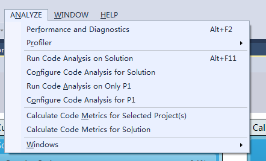
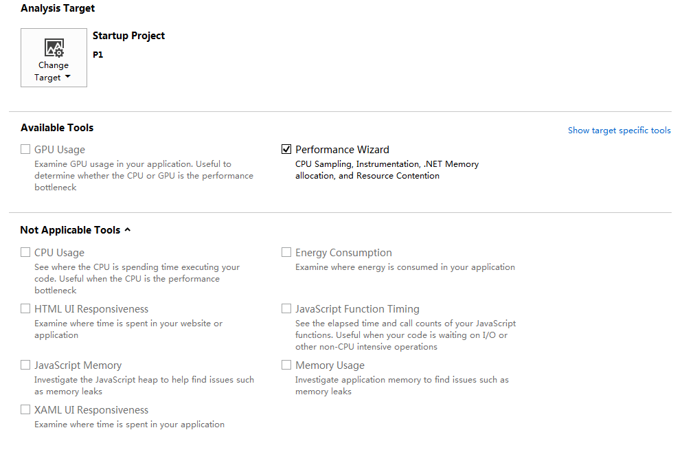
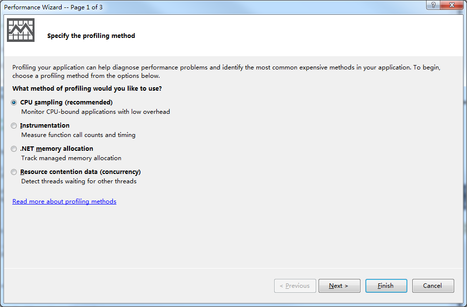
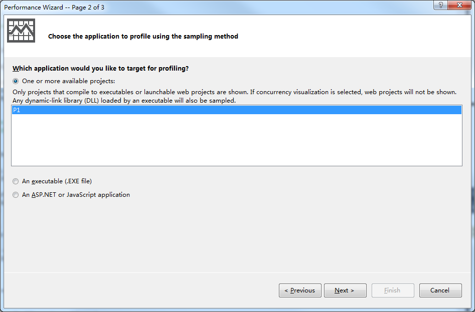
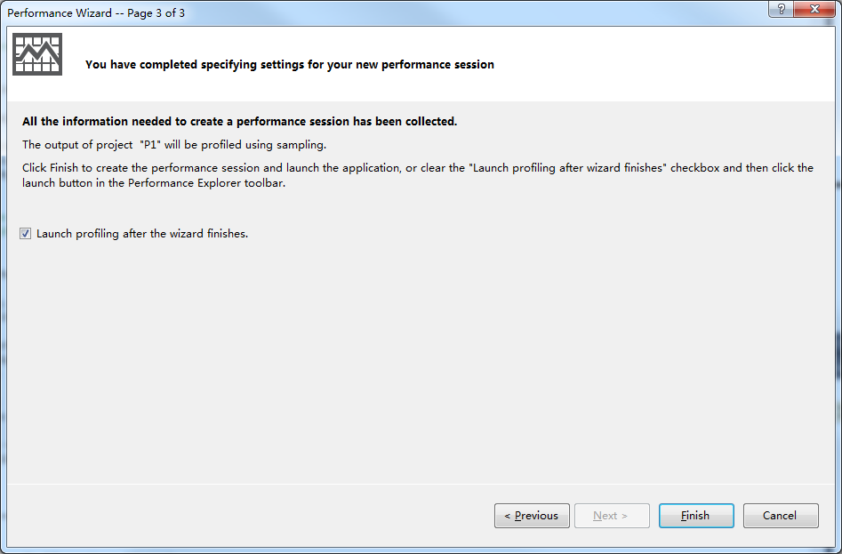
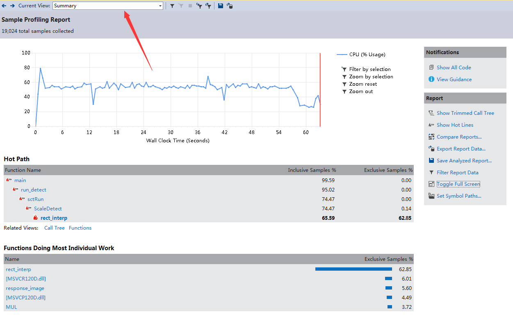
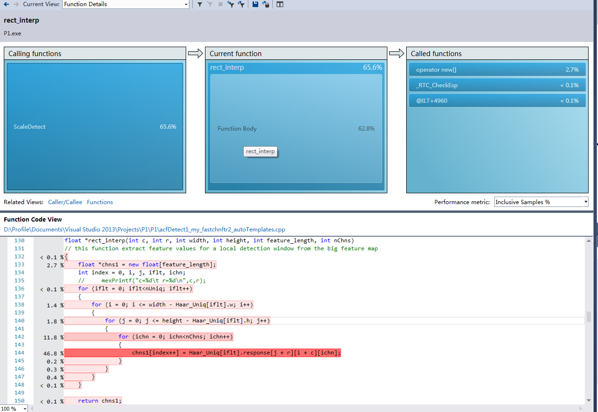

##Visual Studio 代码分析##

If you need to simplily analyze your code, you could use the Analyze of VS. 

1、ANALYZE->Peformance and Diagnostics.

2、Select Performance Wizard and start.

3、Select CPU sampling，One or more available project and Lauch. Waiting for the program end.
 

4、ANALYZE YOUR CODE

