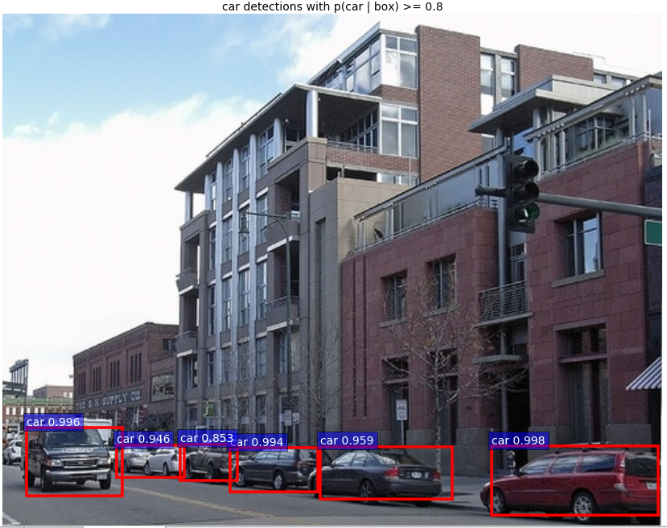

#Windows 下编译Caffe-window#

来源：[http://blog.csdn.net/happynear/article/details/45372231](http://blog.csdn.net/happynear/article/details/45372231)

##准备##
 1.从caffe-window官方fork过来的源码([https://github.com/happynear/caffe-windows](https://github.com/happynear/caffe-windows))下载，第三方库下载([http://pan.baidu.com/s/1nvH7whz](http://pan.baidu.com/s/1nvH7whz))

 2.在caffe源码根目录下建立一个3rdparty文件夹，将第三方库解压进去。然后把3rdparty/bin文件夹添加到环境变量中，方便程序查找第三方库。

 3.如果用GPU的话还需要考虑CUDA的安装。

##编译##

 1.点击./src/caffe/proto/extract_proto.bat批处理文件生成三个文件。

 2.使用GPU的话就打开./buildVS2013/MainBuilder.sln,否则打开./build_cpu_only/MainBuilder.sln来进行编译。注意将编译模式切换成Release X64模式。

	1、用matlab wrapper来提取特征、观察训练好的权重的话呢，只需要把matcaffe项目里面的matlab目录修改成你自
	己的，然后编译，你就能从matlab/+caffe/private文件夹里面找到一个叫caffe_.mexw64的文件。
	2、python的wrapper类似，把pycaffe项目里的python目录改成你自己的（我用的是Anaconda），就能在python/caffe
    文件夹中生成_caffe.pyd的python dll文件。
	python目录的修改的话，点击pycaffe项目->属性->配置属性->C/C++->常规->附加包含目录中和pycaffe项目->属
	性->配置属性->Linker->常规->附加包含目录中python的目录修改(使用Anaconda的话就是直接Anaconda根目录下
	的include，libs，Lib->site-packages)

##测试##

1.下载MNIST的leveldb数据文件，解压至./examples/mnist文件夹中。运行根目录下得run_mnist.bat,既可以开始训练(如果是使用CPU，注意将在mnist下得配置文件的选项改成CPU)。训练日志保存./log文件夹中(以INFO开头，txt格式的日志文件)。

#Windows 下编译fast-rcnn#

参考地址：[http://blog.csdn.net/happynear/article/details/46822109](http://blog.csdn.net/happynear/article/details/46822109)
##准备工作##

1、caffe-windows下载和编译，可以先编译python接口，剩下部分可后面再编译。

2、fast-rcnn:[https://github.com/rbgirshick/fast-rcnn。](https://github.com/rbgirshick/fast-rcnn。)

3、模型文件：原始文件在伯克利的服务器上，也可以到http://pan.baidu.com/s/1kTzQYgR下载，放在fast_rcnn根目录下的data文件夹（`fast_rcnn_root/data`）

4、安装protobu的python接口。google上下载protobuf-2.5.0.zip(源码)和protoc-2.5.0-win32.zip(win32)，源码用于安装环境，win exe 可以直接编译proto文件，将protoc-2.5.0-win32.zip中的protoc.exe放置在protobuf-2.5.0.zip解压出来的`protobuf-2.5.0\src`下。在cmd下切换目录到`protobuf-2.5.0\python`下，执行

	python setup.py build
	python setup.py test
	python setup.py install

成功运行三个命令。

（提前安装Anaconda或python）

5、在cmd中，输入`pip install cython`和`pip install easydict`来安装cython和easydict（Anaconda默认安装了cython），安装失败可能pip版本过低，先输入`pip install pip --upgrade` 升级 pip。

##编译工作##

1、将之前caffe-windows编译出来的python接口文件，即复制`caffe_windows_root/python`目录，复制到 `fast_rcnn_root/caffe-fast-rcnn`。

2、用文本打开`fast_rcnn_root/lib/utils/nms.pyx`，将第25行的`np.int_t`修改为`np.intp_t`，
如果没有修改NMS函数会出现类型不搭配，在后面的测试时。

3、用文本打开`fast_rcnn_root/lib/setup.py`,将第18行和23行的`-Wno-cpp`, `-Wno-unused-function`指令删除，只留下空的中括号[]即可。

4、打开cmd，定位至`fast_rcnn_root/lib`目录中，执行`python setup.py install`。 

	Unable to find vcvarsall.bat 问题
	如果是安装protobu3.0.0的话，可能仅仅支持VS2015。
	解决方法的话：在CMD中输入 
	VS2013:SET VS90COMNTOOLS=%VS120COMNTOOLS%
参考网站：[http://my.oschina.net/soarwilldo/blog/496463](http://my.oschina.net/soarwilldo/blog/496463)

setup.py安装完成后，到`python_root/Lib/site-packages/utils`中可以找到两个文件`cython_bbox.pyd`和`cython_nms.pyd`，把这两个文件复制到`fast_rcnn_root/lib/utils`中。

5、定位至`fast_rcnn_root`，执行`python tools/demo.py`

	%%如果仅仅使用CPU，需要demo.py中修改
    if 1:
        caffe.set_mode_cpu()（使用CPU）
    else:
        caffe.set_mode_gpu()
        caffe.set_device(args.gpu_id)（使用GPU）

